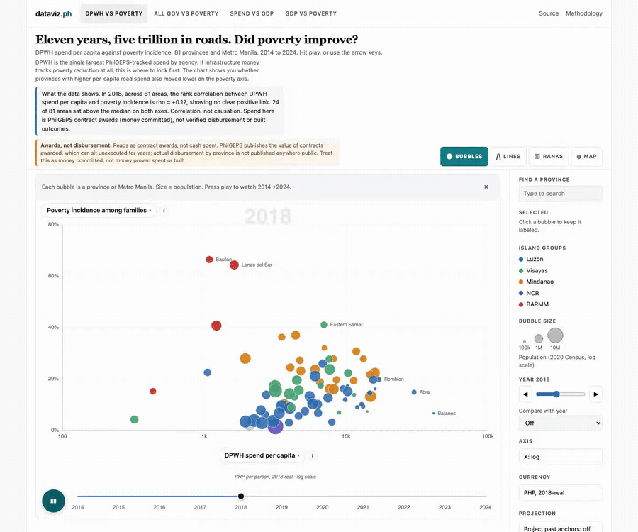
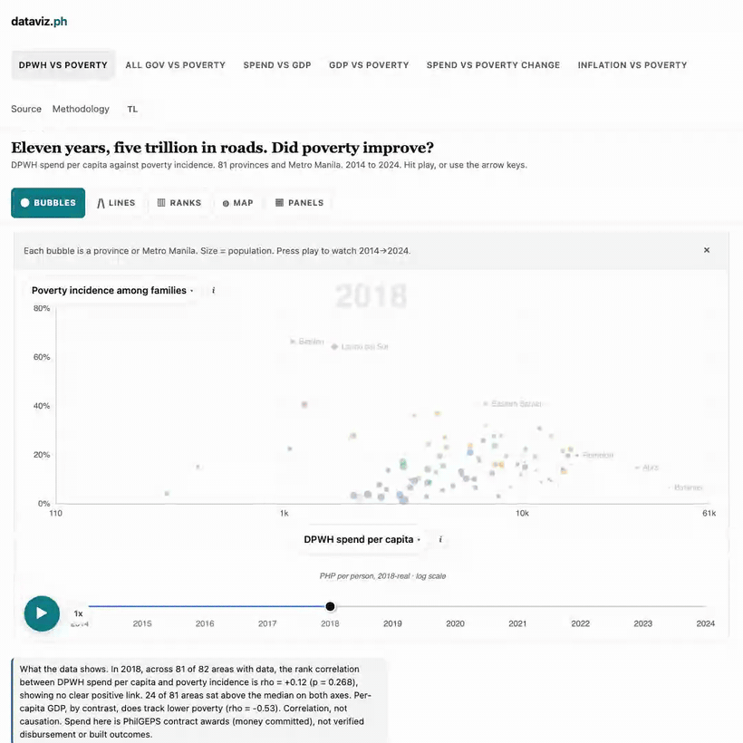

# dataviz.ph

Animated bubble charts of Philippine public data. Pick a story, hit play.



*In motion: DPWH spend vs poverty has no pattern, GDP vs poverty does, then the map. 2014 to 2024.*



*Square cut: DPWH road contracts vs poverty (₱5 trillion, no link), then the same provinces pivoted onto per-capita GDP (the clean diagonal), then regional inflation vs regional poverty — three public sources joined on one set of axes. A [landscape 16:9 version](docs/linkedin-demo-landscape.gif) is in `docs/` too.*

## What the data shows

Joining procurement with outcomes on one set of axes lets you ask whether public money tracked need, and see that it mostly did not. Every figure below is computed by the pipeline (and recomputed live in the page) from the sources further down, not hand-typed.

- **DPWH contract awards attributed to provinces total PHP 5.04 trillion over 2014 to 2024**, and the yearly figure climbed from about PHP 210 billion a year in 2014 to 2016 to a peak of PHP 926 billion in 2024; the 2022 to 2024 average ran about 3.7 times the 2014 to 2016 average.
- **That spending shows no clear link to poverty.** Across 81 provinces plus Metro Manila, the rank correlation between DPWH spend per capita and poverty incidence is about +0.12 (p = 0.268); for all-government spend it is about -0.07 (p = 0.548). No pattern either way.
- **Economic output does track it.** Per-capita GDP against poverty is about -0.53 (p < 0.001): wealthier provinces are clearly less poor. So the spend-vs-poverty cloud is shapeless while GDP-vs-poverty is a clean downward diagonal.
- **Cumulative spend against poverty change is the one weak signal.** The fifth preset sums each province's nominal DPWH awards per capita over 2014 to 2023 and plots it against the change in poverty incidence from 2018 to 2023. Its computed finding: "In 2023, across 82 areas, the rank correlation between cumulative DPWH spend per capita (2014-2023) and poverty change (pp) is rho = -0.25 (p = 0.026), showing a weak negative link. 13 of 82 areas sat above the median on both axes." Weak, and still only association.

Every preset finding now carries a permutation p-value (10,000 shuffles, seeded, computed at build time in `etl/build.py`). Pick a non-preset pair and the page computes a live Spearman rho plus a 1,000-shuffle permutation p at the displayed year.

These are contract *awards* (money committed), not verified disbursement; the gap between the two is exactly what province-level reporting does not publish. Correlation, not causation. The disclaimer at the end applies.

## Indicators and views

Twelve indicators. Eleven can go on either axis; national inflation is a single national series, shown in the line and rank views:

- **Poverty incidence among families** (PSA Full-Year, 2018/2021/2023 anchors, linear-filled to 2014 to 2024)
- **Subsistence incidence among families** (PSA, families below the food threshold; same 2018/2021/2023 anchors, always lower than the poverty line)
- **DPWH spend per capita** (PhilGEPS DPWH-tagged contracts over 2020 Census population, 2014 to 2024, PHP nominal or PHP 2018-real)
- **All PhilGEPS spend per capita** (every province-attributable contract, same shape as DPWH)
- **DOH spend per capita** (PhilGEPS contracts tagged to the Department of Health, sparse coverage, PHP nominal or PHP 2018-real)
- **Infra spend per capita** (PhilGEPS contracts whose title or category contains construction, road, bridge, flood, drainage and related infra keywords, PHP nominal or PHP 2018-real)
- **Cumulative DPWH spend per capita 2014-2023** (running sum of the nominal DPWH series; stays nominal because the 2018-base CPI cannot deflate 2014 to 2017)
- **Per capita GDP** (PSA province-level, constant 2018 PHP, 2022 to 2024)
- **DPWH share of all spend** (DPWH per capita divided by all-spend per capita, percent)
- **Population (2020 Census)** (whole-province population with HUCs rolled in)
- **Poverty change 2018 to 2023** (percentage points, negative means poverty fell)
- **National inflation (CPI year-on-year)** (single national series, useful in line and rank views)

Five chart types in the strip by the title:

- **Bubbles**: x-y scatter with year animation, bubble size = population, color = island group.
- **Lines**: the Y indicator over time, one line per province, selected and auto-trail provinces drawn bold with end labels, others faded for context.
- **Ranks**: a horizontal bar chart of the Y indicator at the current year, sorted descending, colored by island group.
- **Map**: a choropleth of the Y indicator across the provinces, single-hue sequential ramp (light = low, dark = high), with the same year animation.
- **Panels**: two scatters side by side on a shared poverty axis, DPWH spend per capita on the left and per-capita GDP on the right, so the shapeless spend cloud and the GDP diagonal can be read in one glance. Offered only when poverty is on the Y axis.

Axes are locked to each indicator's global cross-year extent, so bubbles move against a fixed frame instead of the frame rescaling under them.

Pick any indicator for X and any for Y by clicking the pill on the axis label itself. A panel slides in with a search box and the full indicator list, with the currently-selected one highlighted and the same-as-other-axis one greyed out.

Six presets are wired as quick-start tabs: DPWH vs poverty, All gov vs poverty, Spend vs GDP, GDP vs poverty, Spend vs poverty change, Inflation vs poverty. Click a preset, both axis pills snap to it. Change a pill, the tab strip shows a "Custom" pill. Every meaningful indicator pair (41 of them) ships with a hand-written headline and tagline, so picker-driven views read like real stories rather than `X vs Y`. Preset findings come from the build; custom pairs get their rho and permutation p computed live in the page.

The inflation preset runs at a coarser grain than the rest: PSA publishes CPI by region, not province, so it plots the 18 official regions (regional CPI year-on-year against PSA's own regional poverty estimate from Table 1a, never an aggregate of provincial rows). The tagline says so on the page. Regions render as equal-size bubbles (no regional population is pulled), the indicator pickers only offer same-grain pairs, and the map view is off at that grain; search, lines, ranks, compare, CI whiskers, and CSV export all work on the 18 units.

Years past the last PSA anchor are held constant by default. Toggle "Project past anchors" in the sidebar and those years switch to a linear projection from the slope of the two nearest anchors. Projected bubbles render with a dashed border so a reader can see at a glance which values are inferred rather than published.

Every view shares the same UI: island-group color, log or linear X, the 3 most-moved provinces auto-trail by default, click a bubble to pin its own trail, search a province (arrow keys move the highlight, Enter picks), step through years, overlay a second year for compare, save the chart as PNG or SVG, download the current year or all years as CSV, copy a deep link that round-trips every state. A teal play button bottom-left of the chart starts the year animation, with a 0.5x / 1x / 2x speed toggle next to it. Clicking an island group in the legend focuses that group and fades the rest (round-trips through the URL as `grp=`). Years between PSA survey anchors carry an "estimated, not surveyed" pill, and 2019 to 2020 poverty tooltips flag that those values are linear estimates across the COVID years. If the map outline or a data file fails to load, the page says so and offers a retry instead of silently rendering nothing.

Bubble encodings are adjustable in the sidebar. The defaults are an editorial choice and stay the defaults: color names the island group (geography stays readable) and size is 2020 Census population (the Gapminder fourth variable). The alternates the data honestly supports are a five-shade quantile ramp of the current Y indicator (same ramp as the map) and equal-size bubbles; both round-trip through the URL (`col=yq`, `size=eq`), and the size key hides itself when size stops encoding anything. On the bubble view, pinch (touch) or Ctrl+scroll (desktop) zooms into the cloud; plain scroll still scrolls the page, and any control change resets the window.

A TL toggle in the topbar switches the first-read surface (story headlines, taglines, the computed finding sentence, control labels) to Tagalog. The finding sentence translates its template and interpolates the same computed rho, p, and counts; no number is retyped per language. The choice persists in localStorage and the page's `lang` attribute follows it.

First visits with no URL hash get a short guided story (hook, reveal, twist, release) before the explorer unlocks. Any click or keypress drops straight into free explore; reduced-motion users get a static annotated view with a play button instead.

## Embed

Any view can be dropped into another page as an iframe. The Embed button copies a ready-to-paste snippet for the current state:

```html
<iframe src="https://dataviz.ph/#embed=1&..." width="800" height="560"
        style="border:0" loading="lazy" title="dataviz.ph chart"></iframe>
```

`#embed=1` hides the chrome and adds a small attribution chip linking back to the full explorer with the same state. Third-party framing is allowed by the CSP; see the framing note under Operations for why that is safe here.

## How it works

A Python pipeline pulls PSA OpenStat (poverty, population, GDP per capita, CPI) and PhilGEPS awards, then writes tidy long-form JSON to `public/data/`. The browser reads the JSON and animates with ECharts. No backend, no API, no build step beyond `python -m etl.build`.

The pipeline de-duplicates PhilGEPS rows on the globally unique award notice id before aggregating (zero duplicates in the current chunks; the total is unchanged). `etl/validate.py` then checks coverage (82 area units per anchor year), uniqueness of (psgc, year) pairs, flags single-year spend jumps over 5x, and compares new medians against the committed files so a silent upstream change cannot slip through a rebuild.

## Run it

```bash
python3 -m venv .venv
source .venv/bin/activate
pip install -e ".[dev]"

python -m etl.build                       # pull data, write public/data/*.json
ruff check etl/ tests/
pytest -q

python -m http.server -d public 8765
open http://localhost:8765/
```

`python -m etl.build --no-cache` clears PSA and PSGC caches and refetches those sources. PhilGEPS uses a separately acquired, reviewed local snapshot; the build never downloads its 15 parquet chunks.

`pytest -q` runs 100 tests. The browser regression tests drive headless Chromium via Playwright; CI installs Chromium and runs them too, so they no longer skip there.

### Operations

**Deploy.** Push to `main` and Vercel ships it. Vercel preview deployments (PR branches) are behind auth (HTTP 401); verify production at `https://dataviz.ph` after merge, not a preview URL.

**Rollback.** `git revert HEAD && git push`, or use Vercel's "Promote to Production" on a prior deployment from the Vercel dashboard.

**Smoke monitoring.** `.github/workflows/smoke.yml` runs every six hours and on manual dispatch. It asserts the homepage returns HTTP 200 with the expected title string, and that `manifest.json` parses, has `sha256_per_file` keys, and is no older than 365 days (warning at 180 days). Failures go to the GitHub Actions notification email.

**Data refresh.** Acquire and review a complete PhilGEPS snapshot before a refresh. Then run `python3 -m etl.build` to regenerate `public/data/`. Pass `--no-cache` only to clear PSA and PSGC caches. After a refresh, commit the updated `public/data/` files and push to deploy.

**Framing note.** `frame-ancestors *` in the CSP (and no `X-Frame-Options` header) allows any third-party site to embed dataviz.ph in an iframe. This is intentional: the site is public data with no authentication and no state-modifying actions, so clickjacking has no target.

**Observability.** Vercel Web Analytics (same-origin script, cookieless) plus a small `track()` queue in `app.js` that reports client errors, data-load soft failures, and guided-arc events (complete, skip, abort). The insights script 404s harmlessly on local servers and until Web Analytics is enabled on the Vercel project.

## Layout

```
etl/         Python pipeline
public/      Static site, pre-baked JSON, vendored ECharts, OG card
tests/       pytest
docs/        Roadmap, demo GIF, OG card source + demo recorder
LICENSE      MIT
```

## Data files

All under `public/data/`. Every file is regenerated by `python -m etl.build`.

| File | Shape | Notes |
|---|---|---|
| `provinces.json` | `{psgc: {name, island_group, region_code, population_2020}}` | 82 units: 81 PSA provinces plus NCR as a single virtual unit. HUCs rolled into parent provinces. |
| `poverty.json` | `[{psgc, year, value, interp, extrap}]` | PSA Full-Year anchors at 2018, 2021, 2023. Linear fill between, held constant before and after. |
| `subsistence.json` | Same shape as `poverty.json`. | PSA subsistence incidence among families, same anchors and fill. |
| `dpwh_spend_per_capita.json` | `[{psgc, year, value, value_real}]` | `value` is PHP nominal. `value_real` is deflated to PHP 2018 via PSA national CPI. Null for years before the CPI base. |
| `all_spend_per_capita.json` | Same shape. | Every PhilGEPS contract per province per year. |
| `doh_spend_per_capita.json` | Same shape. | PhilGEPS contracts where organization name contains "DEPARTMENT OF HEALTH". |
| `infra_spend_per_capita.json` | Same shape. | PhilGEPS contracts whose title or category matches construction / road / bridge / flood / drainage / highway / concreting / asphalt / rehabilitation. |
| `dpwh_spend_per_capita_cum.json` | `[{psgc, year, value}]` | Running sum of nominal DPWH spend per capita from 2014. Nominal only: the 2018-base CPI cannot deflate 2014 to 2017. |
| `gdp_per_capita.json` | `[{psgc, year, value}]` | PSA province-level GDP per capita at constant 2018 prices. |
| `cpi.json` | `{year: index}` | PSA national CPI 2018 = 100. |
| `dpwh_share_pct.json` | `[{psgc, year, value}]` | Derived: DPWH / all-spend * 100, per province per year. |
| `cpi_yoy_pct.json` | `[{psgc, year, value}]` | Derived national series, psgc fixed at "000000000". Year-on-year change in the national CPI. |
| `poverty_change_pp.json` | `[{psgc, year, value}]` | Derived: 2023 minus 2018 poverty incidence in percentage points, repeated across the panel. |
| `population.json` | `[{psgc, year, value}]` | 2020 Census population repeated across the panel so it pairs with year-varying X indicators. |
| `indicators.json` | List of indicator metadata. | Each carries `name`, `unit`, `source`, `source_url`, `definition`, `vintage`. |
| `stories.json` | List of story definitions. | Each carries `headline`, `tagline`, `why`, `finding` (the computed Spearman answer with its permutation p-value, surfaced in the chart), `source_url`, `x`, `y`, `panel_years`, `default_year`. |
| `pair_headlines.json` | Per-pair headlines for picker-driven views. | Keyed by the two indicator IDs sorted alphabetically and joined with `\|`. 41 entries, one per useful pair. The preset pairs are included so picker-reconstructed views match preset tab views. |
| `manifest.json` | Build manifest. | `built_at`, `source_vintages`, `inputs` (PhilGEPS chunk sha256s, PSGC sha256, PSA fetch date and row counts), `row_counts`, `sha256_per_file`, `derived` (the attributed DPWH total and per-province attribution shares). The footer reads this so a journalist can tell how fresh the data is. |

## Sources

- **PSA OpenStat PXWeb API.** No key required. Tables: 1A/PO (population), 1E/FY/Table 1a (poverty), 2A/PPA/2025/Table 9 (per capita GDP), 2M/PI/CPI/2018NEW (CPI all items).
- **PhilGEPS awards parquet.** DPWH subset (organization name contains "PUBLIC WORKS AND HIGHWAYS") and the full set with no agency filter. Mirror: [csiiiv/philgeps-awards-dashboard](https://github.com/csiiiv/philgeps-awards-dashboard) (MIT). 15 chunks, about 620 MB total.
- **PSGC reference.** [psgc.gitlab.io](https://psgc.gitlab.io/api/), community mirror of PSA's classifications, public domain.
- **ECharts 5.6.0.** Apache 2.0, vendored under `public/vendor/` and loaded with a SHA-384 SRI hash.

## Honesty notes

These ship on the standalone `/methodology` page so anyone who asks "is this right?" gets the answer immediately.

- About 20 percent of PhilGEPS award value cannot be attributed to a single province (null `area_of_delivery`, multi-province contracts, "Independent City" bucket) and is excluded from per-capita spend. The build now computes each province's share of the attributed total (`derived.dpwh_attribution_share_by_psgc` in `manifest.json`). BARMM provinces sit near zero on that table because their `area_of_delivery` strings rarely resolve to a single PSGC code, so per-province spend figures there are a conservative lower bound and cross-province spend comparisons understate BARMM.
- Province-years with per-capita under PHP 100 are dropped as likely coverage gaps. The floor lives in `etl/philgeps.py`.
- Maguindanao is shown as the pre-2022 unified unit. PSA's poverty Table 1a still publishes the rolled-up Maguindanao; the del-Norte and del-Sur 2023 rows would silently overwrite the parent, so they are skipped via `psgc.SKIPPED_NAMES`.
- NCR is the regional aggregate (16 cities) treated as a single bubble.
- Poverty rates are PSA's "province-without-HUC" measure. Per-capita spend uses whole-province population (HUCs rolled into parent provinces via `psgc.HUC_TO_PARENT`). Per capita GDP uses PSA's "province-only" measure.
- Bubble size is the 2020 Census and does not animate.
- Every province has all three PSA poverty anchors (2018, 2021, 2023) in `poverty.json`. Sulu fell from 75.3 percent in 2018 to 41.5 in 2021 to 13.0 in 2023. Years before 2018 and after 2023 are held constant at the nearest anchor and drawn with a colored border so the held-constant treatment is visible.
- The deflate-to-2018-real toggle drops bubbles for years before 2018 (the CPI base) and shows an inline notice. No silent fallback to nominal.

All data sourced from public records (PSA OpenStat, PhilGEPS, PSA Census). This tool visualizes statistical indicators only. Specific allegations, if any, require independent investigation and corroboration.

## Accessibility

- The chart `<div>` is focusable. When focused, Left and Right arrows scrub years, Home and End jump to first and last year.
- A `Year Prev / Next` button pair in the controls panel does the same with the mouse or with Tab + Enter.
- A `Compare with year` selector overlays a second year's bubbles as ghost outlines plus a dotted connector between same-province points.
- A hidden screen-reader `<table>` mirrors every visible bubble in the current frame, with proper `<caption>`, `<thead>`, `<tbody>`. The chart `aria-describedby` points to it and to a usage instructions paragraph.
- Touch devices get a tap-to-show tooltip plus a persistent panel below the chart with the last tapped bubble's full values.
- Axis labels carry a small "i" button. Click opens a definition popover with the source link. Keyboard accessible, dismiss on Escape or outside click.
- All buttons are at least 44 px tall on mobile.
- Color contrast: muted text uses `#595959` against white (WCAG AA at body text size).

## Honest gaps

- A screen-reader user can read the data table, use the year buttons, and operate the X/Y indicator dropdowns, but cannot click individual bubbles to pin trails.
- The guided story auto-plays on the first visit (no hash). Shared links with a hash skip it.
- The OG card at `public/og.png` (1200x630) is rendered from `docs/og.html`: open it at a 1200x630 viewport (2x for crisp text), screenshot, downscale to 1200x630. Keep its headline in sync with the default story.
- Compare-with-year is a same-chart overlay. A side-by-side split view is not implemented.

## License

MIT for this repo. ECharts is Apache 2.0. Data: PSA Open Data terms, MIT for the PhilGEPS mirror, public domain for the PSGC mirror.
